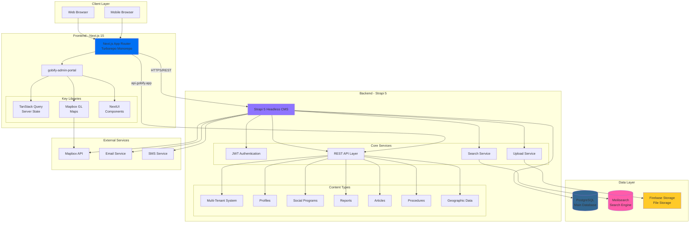

# Gobify Platform - Architecture Overview

This diagram provides a high-level view of the Gobify platform architecture, showing how the frontend, backend, databases, and external services interact.

## System Architecture

## Architecture Components

### Frontend Layer (Next.js 15)
- **Framework**: Next.js 15 with App Router for modern React patterns
- **Build System**: Turborepo for efficient monorepo management
- **State Management**: TanStack Query for server state synchronization
- **UI Components**: NextUI for consistent design system
- **Maps**: Mapbox GL for geographic visualizations
- **Deployment**: Optimized for edge runtime and static generation

### Backend Layer (Strapi 5)
- **CMS**: Strapi 5 Headless CMS for content management
- **API**: RESTful API at api.gobify.app
- **Authentication**: JWT-based authentication and authorization
- **Multi-tenancy**: Tenant-based data isolation
- **Content Types**: 17 main entities managing government services

### Data Layer
- **PostgreSQL**: Primary relational database for structured data
- **Meilisearch**: Fast, typo-tolerant search engine for content discovery
- **Firebase Storage**: Scalable file storage for documents and media

### External Services
- **Mapbox API**: Geographic data and mapping services
- **Email Service**: Notifications and communications
- **SMS Service**: Mobile notifications for citizens

## Key Features

1. **Multi-tenant Architecture**: Supports multiple government departments and services
2. **Real-time Search**: Meilisearch integration for instant search results
3. **Geographic Capabilities**: Street and neighborhood mapping with Mapbox
4. **Social Program Management**: Complete workflow from application to delivery
5. **Report System**: Citizen reports with categorization and tracking
6. **Content Management**: Articles and procedures for public information
7. **Scalable Storage**: Firebase for unlimited file and media storage

## API Communication

All frontend-to-backend communication occurs via:
- **Protocol**: HTTPS/REST
- **Domain**: api.gobify.app
- **Authentication**: JWT tokens in Authorization header
- **Format**: JSON request/response payloads

## Security Considerations

- JWT tokens with configurable expiration
- Multi-tenant data isolation at database level
- Role-based access control (RBAC)
- HTTPS encryption for all communications
- Secure file uploads with validation
- API rate limiting and request validation
