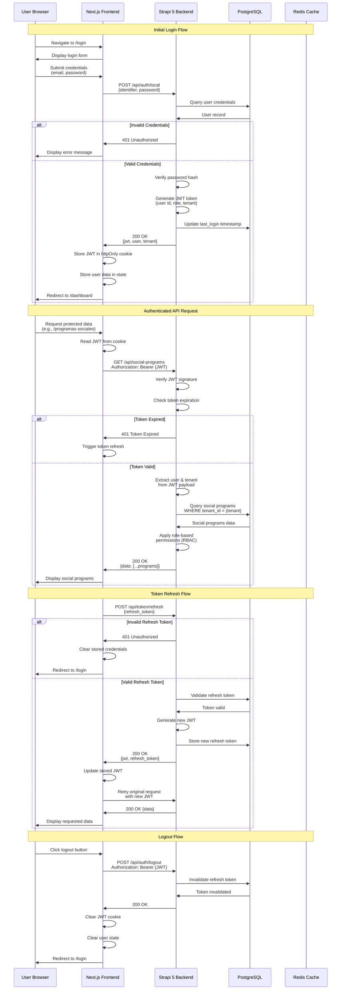
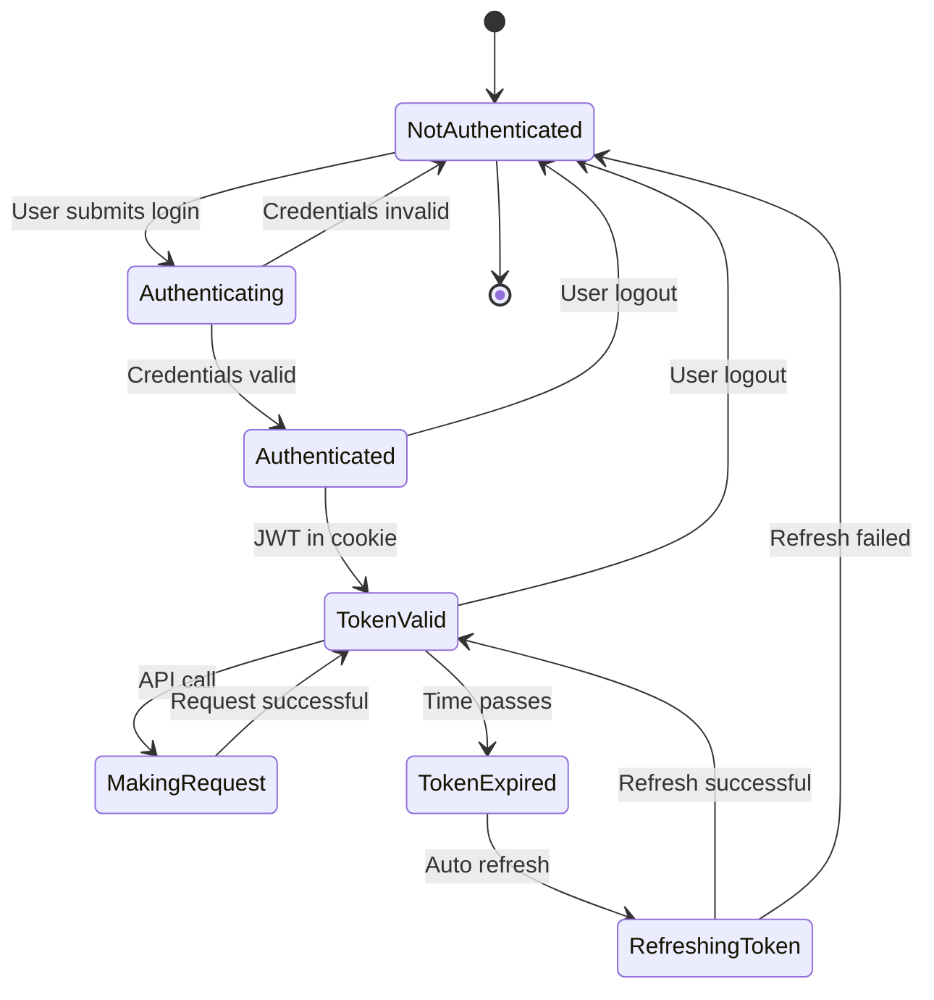

# Gobify Platform - Authentication Flow

This diagram illustrates the JWT-based authentication flow in the Gobify platform, from initial login to API requests and token refresh.

## Authentication Sequence Diagram



## Authentication Flow Details

### 1. Initial Login Flow

**Step 1: User submits credentials**
- User enters email and password in login form
- Frontend validates input format
- Sends POST request to `/api/auth/local`

**Step 2: Strapi validates credentials**
- Queries PostgreSQL for user by email
- Verifies password using bcrypt hash comparison
- Checks if user account is active and not blocked

**Step 3: JWT token generation**
- Creates JWT with payload:
  ```json
  {
    "id": "user_id",
    "role": "admin|editor|citizen",
    "tenant": "tenant_id",
    "iat": "issued_at_timestamp",
    "exp": "expiration_timestamp"
  }
  ```
- Signs token with secret key
- Generates refresh token for long-term authentication

**Step 4: Frontend stores tokens**
- JWT stored in httpOnly cookie (XSS protection)
- User data stored in TanStack Query cache
- Redirect to protected dashboard

### 2. Authenticated API Requests

**Step 1: Frontend reads JWT**
- Retrieves JWT from httpOnly cookie
- Adds to Authorization header: `Bearer {JWT}`

**Step 2: Strapi validates JWT**
- Verifies signature with secret key
- Checks expiration timestamp
- Extracts user ID, role, and tenant from payload

**Step 3: Multi-tenant data isolation**
- All queries automatically filtered by tenant_id
- Example: `WHERE tenant_id = {tenant_from_jwt}`
- Prevents cross-tenant data access

**Step 4: Role-based access control**
- Checks user role against required permissions
- Admin: Full access to all resources
- Editor: Create/update content, view reports
- Citizen: View own data, submit requests

### 3. Token Refresh Flow

**When tokens expire:**
- Access JWT: Short-lived (15-30 minutes)
- Refresh token: Long-lived (7-30 days)

**Refresh process:**
1. Frontend detects 401 Token Expired
2. Sends refresh token to `/api/token/refresh`
3. Strapi validates refresh token in database
4. Issues new JWT and refresh token
5. Frontend retries original request
6. Seamless user experience (no re-login)

### 4. Logout Flow

**Step 1: User initiates logout**
- Click logout button in UI
- Frontend sends logout request

**Step 2: Token invalidation**
- Strapi marks refresh token as invalid in database
- Prevents token reuse after logout

**Step 3: Frontend cleanup**
- Clears httpOnly cookie
- Purges TanStack Query cache
- Resets application state
- Redirects to login page

## Security Features

### JWT Security
- **Signature verification**: Prevents token tampering
- **Expiration checking**: Time-limited access
- **HttpOnly cookies**: XSS attack prevention
- **Secure flag**: HTTPS-only transmission
- **SameSite attribute**: CSRF protection

### Password Security
- **Bcrypt hashing**: Industry-standard password hashing
- **Salt rounds**: Configurable complexity (default: 10)
- **No plaintext storage**: Passwords never stored in plain text

### Multi-tenant Isolation
- **Automatic filtering**: All queries scoped to tenant
- **JWT payload validation**: Tenant ID verified on each request
- **Database constraints**: Foreign key enforcement

### Rate Limiting
- **Login attempts**: Prevent brute force attacks
- **API requests**: Prevent abuse and DDoS
- **Configurable limits**: Per-endpoint rate limits

## Token Lifecycle



## Best Practices

1. **Never store JWT in localStorage**: Use httpOnly cookies
2. **Short-lived access tokens**: 15-30 minutes maximum
3. **Secure token transmission**: Always use HTTPS
4. **Implement token refresh**: Seamless re-authentication
5. **Invalidate on logout**: Prevent token reuse
6. **Monitor failed attempts**: Detect suspicious activity
7. **Use strong secret keys**: Minimum 256-bit entropy
8. **Implement CORS properly**: Whitelist trusted origins
9. **Log authentication events**: Audit trail for security
10. **Regular token rotation**: Refresh tokens periodically

## Error Handling

| Error Code | Scenario | Frontend Action |
|------------|----------|-----------------|
| 401 | Invalid credentials | Show error message |
| 401 | Token expired | Auto-refresh token |
| 401 | Invalid token | Redirect to login |
| 403 | Insufficient permissions | Show access denied |
| 429 | Too many requests | Show rate limit message |
| 500 | Server error | Show generic error |

## Environment Variables

Required configuration for JWT authentication:

```env
# Strapi Backend
JWT_SECRET=your-256-bit-secret-key
JWT_EXPIRES_IN=15m
REFRESH_TOKEN_EXPIRES_IN=7d

# Next.js Frontend
NEXT_PUBLIC_API_URL=https://api.gobify.app
```
