# Gobify Platform - Database Schema

This diagram shows the entity relationships and key attributes for the main database entities in the Gobify platform.

## Entity Relationship Diagram

```mermaid
erDiagram
    TENANT ||--o{ PROFILE : "has"
    TENANT ||--o{ DEPARTMENT : "has"
    TENANT ||--o{ SOCIAL_PROGRAM : "manages"
    TENANT ||--o{ ARTICLE : "publishes"
    TENANT ||--o{ PROCEDURE : "defines"
    TENANT ||--o{ CALLE : "contains"
    TENANT ||--o{ COLONIA : "contains"
    TENANT ||--o{ REPORT_TYPE : "configures"

    PROFILE ||--o{ SOCIAL_PROGRAM_REQUEST : "submits"
    PROFILE ||--o{ COMMENT : "writes"
    PROFILE ||--o{ REPORT : "creates"
    PROFILE }o--|| CALLE : "lives_on"
    PROFILE }o--|| COLONIA : "lives_in"

    DEPARTMENT ||--o{ AREA : "contains"
    DEPARTMENT ||--o{ SOCIAL_PROGRAM : "owns"

    AREA ||--o{ PROFILE : "employs"

    SOCIAL_PROGRAM ||--o{ SOCIAL_PROGRAM_REQUEST : "receives"
    SOCIAL_PROGRAM ||--o{ SOCIAL_PROGRAM_LOG : "tracks"

    SOCIAL_PROGRAM_REQUEST ||--o{ SOCIAL_PROGRAM_LOG : "generates"

    ARTICLE_CATEGORY ||--o{ ARTICLE : "categorizes"
    ARTICLE ||--o{ COMMENT : "receives"

    REPORT_TYPE ||--o{ REPORT : "categorizes"
    REPORT }o--|| CALLE : "located_on"
    REPORT }o--|| COLONIA : "located_in"

    COLONIA ||--o{ CALLE : "contains"

    TENANT {
        int id PK
        string name
        string slug
        string logo
        json settings
        boolean active
        datetime created_at
        datetime updated_at
    }

    PROFILE {
        int id PK
        int tenant_id FK
        int user_id FK
        int area_id FK
        int calle_id FK
        int colonia_id FK
        string first_name
        string last_name
        string email
        string phone
        string curp
        date birth_date
        string gender
        string address
        json metadata
        datetime created_at
        datetime updated_at
    }

    DEPARTMENT {
        int id PK
        int tenant_id FK
        string name
        string description
        string code
        boolean active
        datetime created_at
        datetime updated_at
    }

    AREA {
        int id PK
        int department_id FK
        string name
        string description
        string code
        boolean active
        datetime created_at
        datetime updated_at
    }

    SOCIAL_PROGRAM {
        int id PK
        int tenant_id FK
        int department_id FK
        string name
        text description
        text requirements
        date start_date
        date end_date
        string status
        int max_beneficiaries
        json application_form
        datetime created_at
        datetime updated_at
    }

    SOCIAL_PROGRAM_REQUEST {
        int id PK
        int social_program_id FK
        int profile_id FK
        string status
        json form_data
        json documents
        text admin_notes
        datetime submitted_at
        datetime reviewed_at
        datetime approved_at
        datetime delivered_at
        datetime created_at
        datetime updated_at
    }

    SOCIAL_PROGRAM_LOG {
        int id PK
        int social_program_id FK
        int social_program_request_id FK
        int user_id FK
        string action
        string old_status
        string new_status
        text notes
        datetime created_at
    }

    REPORT {
        int id PK
        int tenant_id FK
        int profile_id FK
        int report_type_id FK
        int calle_id FK
        int colonia_id FK
        string title
        text description
        string status
        json location
        json images
        int priority
        datetime resolved_at
        datetime created_at
        datetime updated_at
    }

    REPORT_TYPE {
        int id PK
        int tenant_id FK
        string name
        string description
        string icon
        string color
        int priority
        boolean active
        datetime created_at
        datetime updated_at
    }

    ARTICLE {
        int id PK
        int tenant_id FK
        int article_category_id FK
        int author_id FK
        string title
        string slug
        text content
        text excerpt
        string featured_image
        string status
        datetime published_at
        int views_count
        datetime created_at
        datetime updated_at
    }

    ARTICLE_CATEGORY {
        int id PK
        string name
        string slug
        string description
        datetime created_at
        datetime updated_at
    }

    COMMENT {
        int id PK
        int article_id FK
        int profile_id FK
        int parent_id FK
        text content
        string status
        datetime created_at
        datetime updated_at
    }

    PROCEDURE {
        int id PK
        int tenant_id FK
        string name
        text description
        text requirements
        text steps
        int estimated_days
        decimal cost
        json documents_required
        string status
        datetime created_at
        datetime updated_at
    }

    CALLE {
        int id PK
        int tenant_id FK
        int colonia_id FK
        string name
        string code
        json geometry
        datetime created_at
        datetime updated_at
    }

    COLONIA {
        int id PK
        int tenant_id FK
        string name
        string code
        string postal_code
        json geometry
        json metadata
        datetime created_at
        datetime updated_at
    }

    GLOBAL {
        int id PK
        string site_name
        string site_description
        json contact_info
        json social_media
        json settings
        datetime updated_at
    }

    ABOUT {
        int id PK
        string title
        text mission
        text vision
        text values
        json team_members
        json history
        datetime updated_at
    }
```

## Database Schema Overview

### Core Entities

#### Tenant Management
- **tenant**: Multi-tenant support for different government entities
  - Each tenant has isolated data
  - Configurable settings and branding
  - Active/inactive status control

#### User & Profile Management
- **profile**: Citizen and employee profiles
  - Links to authentication user
  - Geographic location (street and neighborhood)
  - Personal information (CURP, birth date, gender)
  - Metadata for extensibility

#### Organizational Structure
- **department**: Government departments
  - Belongs to a tenant
  - Contains multiple areas
  - Manages social programs

- **area**: Sub-divisions within departments
  - Assigns employees (profiles)
  - Organizational hierarchy

### Social Programs Module

#### Program Management
- **social_program**: Government assistance programs
  - Configurable application forms (JSON)
  - Date-based availability
  - Beneficiary limits
  - Status tracking

- **social_program_request**: Citizen applications
  - Dynamic form data storage (JSON)
  - Document attachments (JSON)
  - Multi-stage workflow: En proceso → Validado → Entregado/Negado
  - Audit trail with timestamps

- **social_program_log**: Activity logging
  - Tracks all status changes
  - Records user actions
  - Maintains history for compliance

### Geographic Module

#### Location Entities
- **colonia**: Neighborhoods/colonies
  - GeoJSON geometry for mapping
  - Postal codes
  - Metadata for demographics

- **calle**: Streets
  - Belongs to a neighborhood
  - GeoJSON geometry
  - Street codes for addressing

### Citizen Services

#### Report System
- **report**: Citizen reports and complaints
  - Categorized by type
  - Geographic location (street and neighborhood)
  - Image attachments (JSON array)
  - Priority levels
  - Status workflow with resolution tracking

- **report_type**: Report categories
  - Icons and colors for UI
  - Priority configuration
  - Active/inactive control

#### Content Management
- **article**: News and informational content
  - Categorized content
  - Rich text content
  - SEO-friendly slugs
  - View tracking
  - Draft/published workflow

- **article_category**: Content categorization
  - Hierarchical organization
  - URL-friendly slugs

- **comment**: User engagement
  - Threaded comments (parent_id)
  - Moderation status
  - Links to articles and profiles

#### Procedures
- **procedure**: Government service procedures
  - Step-by-step instructions
  - Required documents (JSON)
  - Time and cost estimates
  - Status management

### Global Configuration

- **global**: Site-wide settings
  - Contact information
  - Social media links
  - General configuration

- **about**: About page content
  - Mission, vision, values
  - Team information
  - Organizational history

## Key Relationships

1. **Multi-tenancy**: All major entities link to tenant for data isolation
2. **Geographic Hierarchy**: Tenant → Colonia → Calle → Profile/Report
3. **Organizational Hierarchy**: Tenant → Department → Area → Profile
4. **Social Program Workflow**: Program → Request → Log (audit trail)
5. **Content Structure**: Category → Article → Comment

## Data Types

- **JSON Fields**: Used for flexible, schema-less data (form_data, metadata, settings)
- **Timestamps**: Created_at and updated_at for audit trails
- **Status Fields**: String enums for workflow management
- **Foreign Keys**: Enforce referential integrity
- **GeoJSON**: Standard format for geographic data

## Indexes and Performance

Recommended indexes for optimal performance:
- Tenant ID on all multi-tenant tables
- Status fields for workflow queries
- Created_at/updated_at for time-based queries
- Foreign keys for join operations
- Slug fields for URL lookups
- Geographic indexes for spatial queries
