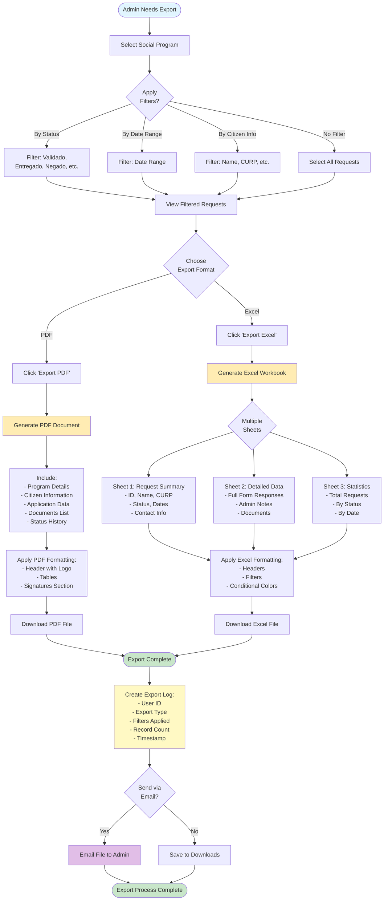
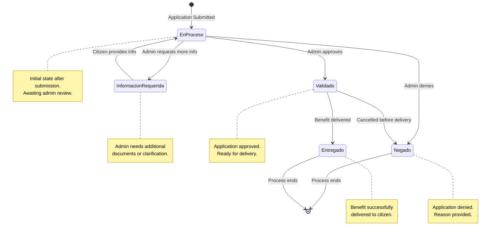

# Gobify Platform - Social Program Workflow

This diagram illustrates the complete workflow for social program management, from citizen application to final delivery or denial, including admin review and export capabilities.

## Social Program Application Workflow

```mermaid
flowchart TD
    Start([Citizen Visits Platform]) --> Login{User<br/>Authenticated?}

    Login -->|No| LoginPage[Navigate to Login Page]
    LoginPage --> Auth[Enter Credentials]
    Auth --> Login

    Login -->|Yes| Dashboard[View Dashboard]
    Dashboard --> BrowsePrograms[Browse Available<br/>Social Programs]

    BrowsePrograms --> FilterPrograms{Filter<br/>Programs}
    FilterPrograms -->|By Department| FilterDept[Filter by Department]
    FilterPrograms -->|By Status| FilterStatus[Filter by Status]
    FilterPrograms -->|By Date| FilterDate[Filter by Date Range]
    FilterDept --> ViewList[View Programs List]
    FilterStatus --> ViewList
    FilterDate --> ViewList

    ViewList --> SelectProgram[Select a Program]
    SelectProgram --> ViewDetails[View Program Details]

    ViewDetails --> CheckEligible{Check<br/>Eligibility}
    CheckEligible -->|Not Eligible| ShowRequirements[Show Requirements<br/>& Criteria]
    ShowRequirements --> BrowsePrograms

    CheckEligible -->|Eligible| StartApp[Click 'Apply Now']
    StartApp --> FillForm[Fill Application Form]

    FillForm --> FormValidation{Form<br/>Valid?}
    FormValidation -->|No| ShowErrors[Show Validation Errors]
    ShowErrors --> FillForm

    FormValidation -->|Yes| UploadDocs[Upload Required Documents]
    UploadDocs --> ReviewApp[Review Application]
    ReviewApp --> ConfirmSubmit{Confirm<br/>Submission?}

    ConfirmSubmit -->|No| FillForm
    ConfirmSubmit -->|Yes| SubmitApp[Submit Application]

    SubmitApp --> CreateRequest[Create social_program_request<br/>Status: 'En proceso']
    CreateRequest --> LogSubmission[Create social_program_log<br/>Action: 'submitted']
    LogSubmission --> NotifyCitizen[Send Email Notification<br/>to Citizen]
    NotifyCitizen --> NotifyAdmin[Notify Admin Team]

    NotifyAdmin --> CitizenWait[Citizen Waits for Review]
    CitizenWait --> CheckStatus{Citizen Checks<br/>Status?}
    CheckStatus -->|Yes| ViewStatus[View Request Status<br/>in Dashboard]
    ViewStatus --> CitizenWait
    CheckStatus -->|No| CitizenWait

    NotifyAdmin --> AdminQueue[Request Added to<br/>Admin Review Queue]

    AdminQueue --> AdminLogin[Admin Logs In]
    AdminLogin --> AdminDash[View Admin Dashboard]
    AdminDash --> ViewQueue[View Pending Requests]

    ViewQueue --> SelectRequest[Select Request to Review]
    SelectRequest --> ReviewDetails[Review Application Details]
    ReviewDetails --> CheckDocs[Check Uploaded Documents]
    CheckDocs --> VerifyInfo[Verify Citizen Information]

    VerifyInfo --> AdminDecision{Admin<br/>Decision}

    AdminDecision -->|Need More Info| RequestMoreInfo[Request Additional Info]
    RequestMoreInfo --> UpdateStatus1[Update Status:<br/>'Información requerida']
    UpdateStatus1 --> LogAction1[Create Log: 'info_requested']
    LogAction1 --> NotifyInfoNeeded[Notify Citizen via Email]
    NotifyInfoNeeded --> CitizenProvides[Citizen Provides<br/>Additional Info]
    CitizenProvides --> AdminQueue

    AdminDecision -->|Approve| ValidateRequest[Change Status to<br/>'Validado']
    ValidateRequest --> LogValidation[Create Log: 'validated']
    LogValidation --> AddNotes[Add Admin Notes<br/>& Comments]
    AddNotes --> NotifyValidated[Email: Application Approved]

    NotifyValidated --> ScheduleDelivery[Schedule Delivery/<br/>Pick-up]
    ScheduleDelivery --> DeliveryProcess{Delivery<br/>Completed?}

    DeliveryProcess -->|No| WaitDelivery[Wait for Delivery]
    WaitDelivery --> DeliveryProcess

    DeliveryProcess -->|Yes| MarkDelivered[Update Status:<br/>'Entregado']
    MarkDelivered --> LogDelivery[Create Log: 'delivered']
    LogDelivery --> NotifyDelivered[Email: Benefit Delivered]
    NotifyDelivered --> RequestComplete([Request Complete])

    AdminDecision -->|Deny| DenyRequest[Change Status to<br/>'Negado']
    DenyRequest --> AddDenyReason[Add Denial Reason<br/>in Admin Notes]
    AddDenyReason --> LogDenial[Create Log: 'denied']
    LogDenial --> NotifyDenied[Email: Application Denied<br/>with Reason]
    NotifyDenied --> CanReapply{Can<br/>Reapply?}
    CanReapply -->|Yes| ReapplyInfo[Show Reapplication Info]
    ReapplyInfo --> BrowsePrograms
    CanReapply -->|No| RequestClosed([Request Closed])

    style Start fill:#e1f5ff
    style RequestComplete fill:#c8e6c9
    style RequestClosed fill:#ffcdd2
    style CreateRequest fill:#fff9c4
    style LogSubmission fill:#fff9c4
    style LogValidation fill:#fff9c4
    style LogDelivery fill:#fff9c4
    style LogDenial fill:#fff9c4
    style NotifyCitizen fill:#e1bee7
    style NotifyAdmin fill:#e1bee7
    style NotifyValidated fill:#e1bee7
    style NotifyDelivered fill:#e1bee7
    style NotifyDenied fill:#e1bee7
    style NotifyInfoNeeded fill:#e1bee7
```



## Export Functionality Workflow



## Status State Machine



## Workflow Details

### 1. Citizen Application Process

**Step 1: Authentication & Discovery**
- Citizen logs in to platform
- Browses available social programs
- Filters by department, status, or date
- Views program details and requirements

**Step 2: Eligibility Check**
- System displays eligibility criteria
- Citizen self-assesses eligibility
- If not eligible, returns to program list

**Step 3: Application Submission**
- Clicks "Apply Now" button
- Fills dynamic application form (JSON schema)
- Uploads required documents to Firebase Storage
- Reviews application before submission
- Confirms and submits

**Step 4: System Processing**
- Creates `social_program_request` record with status "En proceso"
- Creates initial `social_program_log` entry
- Sends email confirmation to citizen
- Notifies admin team via email/dashboard

### 2. Admin Review Process

**Step 1: Queue Management**
- Admin logs in to admin portal
- Views pending requests in review queue
- Requests sorted by submission date, priority, or department

**Step 2: Detailed Review**
- Opens request details
- Reviews citizen information
- Checks uploaded documents
- Verifies eligibility against program criteria

**Step 3: Decision Making**

**Option A: Request More Information**
- Changes status to "Información requerida"
- Adds notes specifying what's needed
- System emails citizen with request
- Citizen provides info, status returns to "En proceso"

**Option B: Approve Application**
- Changes status to "Validado"
- Creates log entry with "validated" action
- Adds approval notes
- System emails citizen with approval
- Schedules delivery or pickup

**Option C: Deny Application**
- Changes status to "Negado"
- Adds detailed denial reason
- Creates log entry with "denied" action
- System emails citizen with reason
- Optionally includes reapplication information

### 3. Delivery Process

**For Approved Applications ("Validado"):**
- Admin schedules delivery or pickup
- Coordinates with citizen
- Upon completion, changes status to "Entregado"
- Creates delivery log entry
- Sends final confirmation email

### 4. Export Functionality

**PDF Export:**
- Single or multiple request details
- Formatted document with:
  - Organization logo and header
  - Program information
  - Citizen details (name, CURP, address)
  - Application responses
  - Uploaded documents list
  - Status history timeline
  - Admin notes
  - Signature sections
- Use case: Official records, printing, archival

**Excel Export:**
- Multiple requests in spreadsheet format
- Multiple sheets:
  - **Summary Sheet**: Overview data (ID, name, status, dates)
  - **Details Sheet**: Full form responses, admin notes
  - **Statistics Sheet**: Aggregated data, charts
- Features:
  - Auto-filters on headers
  - Conditional formatting (color-coded by status)
  - Formulas for calculations
  - Frozen header row
- Use case: Data analysis, reporting, bulk processing

**Export Options:**
- Filter before export (status, date range, department)
- Email to admin or download locally
- Audit log created for each export
- Tracks who exported what and when

## Status Definitions

| Status | Description | Triggered By | Next Possible States |
|--------|-------------|--------------|---------------------|
| **En proceso** | Initial status after submission, awaiting review | Citizen submission | Validado, Negado, Información requerida |
| **Información requerida** | Admin needs additional info/documents | Admin action | En proceso (after citizen provides info) |
| **Validado** | Application approved, ready for delivery | Admin approval | Entregado, Negado (if cancelled) |
| **Entregado** | Benefit delivered to citizen | Admin confirmation | Final state |
| **Negado** | Application denied | Admin denial | Final state |

## Notification Events

| Event | Recipient | Content |
|-------|-----------|---------|
| Application submitted | Citizen | Confirmation email with request ID |
| Application submitted | Admin team | New request notification |
| More info requested | Citizen | Details of what's needed |
| Application approved | Citizen | Approval confirmation, next steps |
| Delivery scheduled | Citizen | Date, time, location details |
| Benefit delivered | Citizen | Completion confirmation |
| Application denied | Citizen | Denial reason, reapplication info |

## Database Updates

### social_program_request Table
```sql
-- On submission
INSERT INTO social_program_request (
  social_program_id,
  profile_id,
  status,
  form_data,
  documents,
  submitted_at
) VALUES (...);

-- On status change
UPDATE social_program_request
SET status = 'Validado',
    admin_notes = 'Approved after verification',
    reviewed_at = NOW()
WHERE id = ?;

-- On delivery
UPDATE social_program_request
SET status = 'Entregado',
    delivered_at = NOW()
WHERE id = ?;
```

### social_program_log Table
```sql
-- Log each action
INSERT INTO social_program_log (
  social_program_id,
  social_program_request_id,
  user_id,
  action,
  old_status,
  new_status,
  notes
) VALUES (...);
```

## Performance Considerations

1. **Async Processing**: Document uploads handled asynchronously
2. **Email Queues**: Notifications sent via background jobs
3. **Pagination**: Large request lists paginated
4. **Caching**: Program details cached for faster loading
5. **Indexing**: Database indexes on status, created_at for queries
6. **Export Limits**: Maximum records per export to prevent timeouts

## Security & Compliance

- **Data Privacy**: Only authorized admins can view applications
- **Audit Trail**: All status changes logged with user and timestamp
- **Document Security**: Firebase Storage with access tokens
- **Multi-tenant Isolation**: Requests filtered by tenant_id
- **GDPR Compliance**: Export includes all citizen data for transparency
